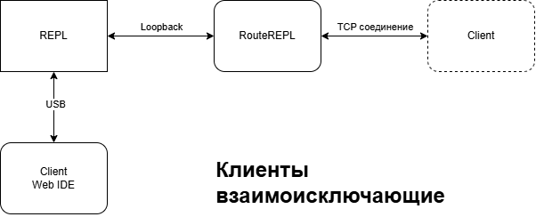
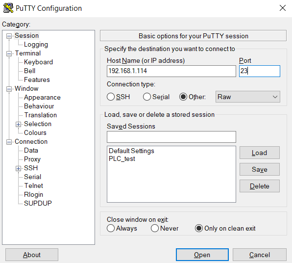
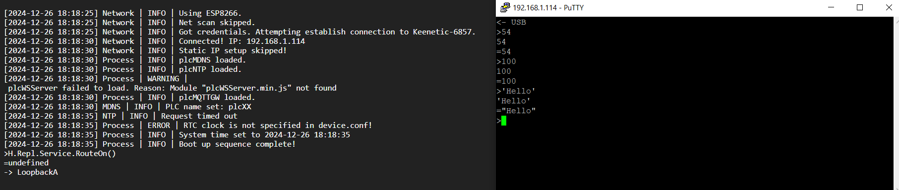

<div style = "font-family: 'Open Sans', sans-serif; font-size: 16px">

# ModuleRouteREPL
<div style = "color: #555">
    <p align="center">
    
    </p>
</div>

## Лицензия
<div style = "color: #555">
    В разработке
</div>

## Описание
<div style = "color: #555">

Служба **RouteREPL** является частью фреймворка **Horizon Automated** и предназначена для контроля над средствами REPL (интерактивной консоли): перехвата и маршрутизации входящих и исходящих сообщений. 

Служба позволяет подключиться к PLC с удалённого терминала, работающего через подключение по протоколу **Telnet (RAW)**. 

Возможность нескольких одновременных подключений не предусматривается. 
</div>

<div align="center">
    
</div>

### Конфигурация
<div style = "color: #555">

Служба указывается в конфигурационном файле **services.json**

*AdvancedOptions* позволяет задать порт TCP-сервера и указать будет ли сервер создан автоматически. Значения по умолчанию: *23* и *false* соответственно. 

```json
"Repl" : {
    "Status" : "stopped",
    "ErrorMsg" : "",
    "Importance" : "Primary",
    "InitOrder" : 5,
    "AdvancedOptions" : {
        "port": 23,
        "autoRouteOn": true
    },
    "Dependency" : ["plcRouteREPL.min.js"],
    "Description" : ""
}
```
</div>

### Поля
<div style = "color: #555">

- <mark style="background-color: lightblue">_DefConsole</mark> - ссылка на инициализированный объект класса Serial, который используется для текстового ввода и вывода по умолчанию;
- <mark style="background-color: lightblue">_IsOn</mark> - булевый флаг, который взводится при запуске TCP-сервера;     
- <mark style="background-color: lightblue">_ReconnectTry</mark> - кол-во  попыток обратно "поднять" сервер;     
- <mark style="background-color: lightblue">_Port</mark> - выбранный порт; 
- <mark style="background-color: lightblue">_Server</mark> - ссылка на сервер; 
- <mark style="background-color: lightblue">_Socket</mark> - активное подключение.     

</div>

### Методы
<div style = "color: #555">

- <mark style="background-color: lightblue">RouteOn()</mark> - инициирует перехват консоли, инициализацию некоторых обработчиков событий;
- <mark style="background-color: lightblue">RouteOff()</mark> - возвращает работу консоли в состояние по умолчанию (как при самом запуске PLC).
</div>

### Принцип перехвата консоли
<div style = "color: #555">

Для реализации функционала *RouteREPL* необходимо перехватить поток передачи данных и провести его через обработчики модуля.

Модуль RouteREPL работает следующим образом:

1. Создается TCP-сервер с прослушиванием указанного порта (23 по умолчанию);
2. При подключении нового клиента предыдущий (если он существует) принудительно отключается, чтобы обеспечить единственное активное соединение;
3. Выполняется перехват консоли;
Данные из консоли перенаправляются на подключенный сокет клиента, и наоборот, данные от клиента поступают в консоль.

</div>

### Примеры
<div style = "color: #555">
```js
H.Repl.Service.RouteOn();
```
Подключение к PLC с помощью утилиты PuTTY

<div align="center">
    
</div>
Видно что при запуске системы логи выводятся в стандартную консоль, а после перехвата на блокируется. 
<div align="center">
    
</div>

</div>

### Зависимости
<div style = "color: #555">

- <mark style="background-color: lightblue">[plcAppError](../../plcAppError/res/README.md)</mark>

</div>

</div>
