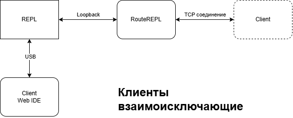
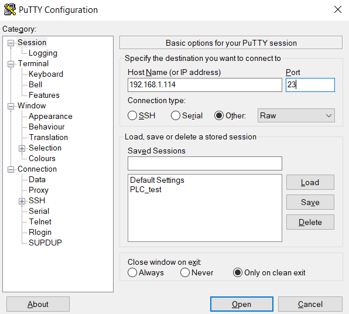
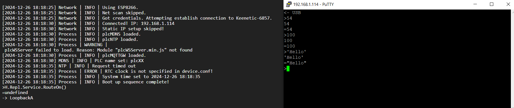

<div style = "font-family: 'Open Sans', sans-serif; font-size: 16px">

# ModuleRouteREPL
<div style = "color: #555">
    <p align="center">
    
    </p>
</div>

## Лицензия
<div style = "color: #555">
    В разработке
</div>

## Описание
<div style = "color: #555">

Служба **RouteREPL** является частью фреймворка **Horizon Automation** и предназначена для контроля над средствами REPL (интерактивной консоли): перехвата и маршрутизации входящих и исходящих сообщений. 

Служба позволяет подключиться к PLC с удалённого терминала, работающего через подключение по TCP, или COM-порту. 

Возможность нескольких одновременных подключений не предусматривается. 
</div>

<div align="center">
    
</div>

### Конфигурация
<div style = "color: #555">

Служба указывается в конфигурационном файле **services.json**

*AdvancedOptions* позволяет задать конфигурацию **TCP-сервера** и/или **UART**-шины, используемых для коммуникации.
Значение tcp-порта по умолчанию: *23*. 

```json
"Repl" : {
    "Status" : "stopped",
    "ErrorMsg" : "",
    "Importance" : "Primary",
    "InitOrder" : 5,
    "AdvancedOptions" : {
        "port": 23,
        "bus": {
            "index": "Serial4",
            "baudrate": 115200
        }
    },
    "Dependency" : ["plcRouteREPL.min.js"],
    "Description" : ""
}
```
</div>

### Поля
<div style = "color: #555">

- <mark style="background-color: lightblue">_DefConsole</mark> - ссылка на инициализированный объект класса Serial, который используется для текстового ввода и вывода по умолчанию;
- <mark style="background-color: lightblue">_IsOn</mark> - булевый флаг, который взводится при запуске TCP-сервера;     
- <mark style="background-color: lightblue">_ReconnectTry</mark> - кол-во  попыток обратно "поднять" сервер;     
- <mark style="background-color: lightblue">_Port</mark> - выбранный порт; 
- <mark style="background-color: lightblue">_Server</mark> - ссылка на сервер; 
- <mark style="background-color: lightblue">_Socket</mark> - активное подключение.     

</div>

### Методы
<div style = "color: #555">
— <mark style="background-color: lightblue">get ConsoleType()</mark> — определяет и возвращает текущий тип подключения консоли: USB, UART, TCP, null или пустую строку в случае некорректного состояния. Используется для анализа текущего режима консольного ввода/вывода;
— <mark style="background-color: lightblue">RouteOn()</mark> — запускает маршрутизацию консоли: инициализирует TCP-сервер, мониторинг UART-шины и состояние подключения USB. Подписывается на событие смены консоли EVENT_CH_CONSOLE и переключает консольный ввод-вывод в зависимости от источника;
— <mark style="background-color: lightblue">RouteOff()</mark> — отключает активные подключения и возвращает поведение консоли к исходному состоянию.
— <mark style="background-color: lightblue">ListenTCP()</mark> — запускает TCP-сервер, ожидающий подключения клиента. При подключении завершает предыдущее соединение (если такое было) и вызывает перехват консоли;
— <mark style="background-color: lightblue">ListenUART()</mark> — запускает мониторинг UART-шины. Если получено сообщение, заканчивающееся \r\n, и текущая консоль — не UART, происходит переключение консоли на UART. При повторных сообщениях с таймаутом — консоль освобождается (устанавливается null);
— <mark style="background-color: lightblue">ListenUSB()</mark> — запускает периодическую проверку состояния USB-подключения. При подключении — переключает консоль на USB; при отключении и отсутствии другого активного подключения — освобождает консоль (устанавливает null);
— <mark style="background-color: lightblue">SetConsole(_source, _cb)</mark> — переназначает системную консоль на указанный источник. Если источник — сокет, устанавливает двунаправленную связь через LoopbackA и LoopbackB. В остальных случаях напрямую устанавливает консоль через E.setConsole;
<mark style="background-color: lightblue">UploadFile(_fileName, _fileSize)</mark>
— предназначен для получения и сохранения файла из консольного соединения в хранилище устройстваж
<mark style="background-color: lightblue">GetFileList()</mark>
— возвращает перечень файлов, доступных в памяти устройстваж
<mark style="background-color: lightblue">SendFileList()</mark>
— отправляет список файлов через установленное сетевое соединениеж
<mark style="background-color: lightblue">SendFiles(_args)</mark>
— выполняет последовательную передачу одного или нескольких файлов по сети.

</div>

### Принцип перехвата консоли
<div style = "color: #555">

Для реализации функционала *RouteREPL* необходимо перехватить поток передачи данных и провести его через обработчики модуля.

Модуль RouteREPL работает следующим образом:

1. Запускается TCP-сервер (по умолчанию на порту 23);
2. При подключении клиента предыдущий (если был) отключается, чтобы сохранить единственный активный канал;
3. Производится перехват консоли с направлением потока данных между консолью и выбранным интерфейсом;
4. Подключение к UART-шине отслеживается: при поступлении определённого управляющего сигнала производится переключение консоли на UART или её сброс в случае бездействия;
5. Состояние USB проверяется периодически — при подключении USB консоль автоматически перенаправляется на него, при отключении — освобождается, если нет других активных интерфейсов.

</div>

### Примеры
<div style = "color: #555">
```js
H.Repl.Service.RouteOn();
```
Подключение к PLC с помощью утилиты PuTTY.

В зависимости от выбранной утилиты подключение может отличаться. Например, в XShell необходимо выбирать протокол не **RAW**, а Telnet. 
При работе с Telnet через командную строку может наблюдаться дублирование вх. символов.

<div align="center">
    
</div>
Видно что при запуске системы логи выводятся в стандартную консоль, а после перехвата на блокируется. 
<div align="center">
    
</div>

</div>

### Зависимости
<div style = "color: #555">

- <mark style="background-color: lightblue">[plcAppError](../../plcAppError/res/README.md)</mark>

</div>

</div>
