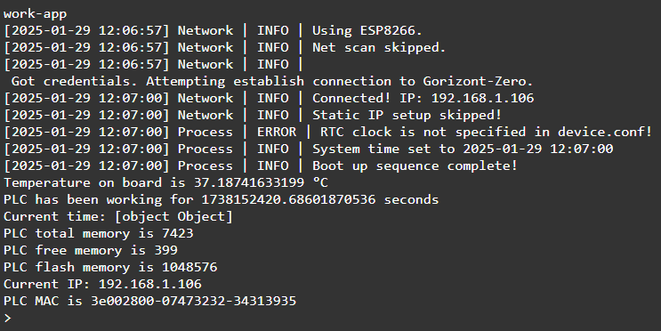

<div style = "font-family: 'Open Sans', sans-serif; font-size: 16px">

# ModuleSensorMCU

<div style = "color: #555">
    <p align="center">
    
    </p>
</div>

## Лицензия

<div style = "color: #555">

В разработке
</div>

## Описание
<div style = "color: #555">

Модуль предназначен для мониторинга состояния контроллера в рамках фреймворка **Horizon Automation** и обеспечивает мониторинг следующих показаний PLC:
- температура
- время непрерывной работы
- текущее время (в виде строки)
- время системы
- свободная память
- общая память
- флэш память
- ip
- mac

Модуль разработан в соответствии с [архитектурой сенсоров](../../plcSensor/res/README.md), соответственно, *ClassSensorPLC* наследует и реализует является функционал *ClassSensor*, а прикладная работа с данным модулем выполняется через *ClassChannelSensor*, который обеспечивает унифицированный интерфейс.

</div>

## Конструктор
<div style = "color: #555">

Конструктор принимает следующие данные из конфига:
```json
"SensorPLC": {
    "name": "SensorPLC",
    "pollFreq": 1,      // частота опроса
    "article": '02-501-0204-201-0514',
    "channelNames": [
        "PLC_temperature",
        "PLC_worktime",
        "PLC_current_time",
        "PLC_total_memory",
        "PLC_free_memory",
        "PLC_flash_memory",
        "PLC_ip",
        "PLC_mac"
    ],
    "modules": ["plcSensorPLC.min.js"]
}
```

</div>

### Методы
<div style = "color: #555">

- <mark style="background-color: lightblue">Start(_chNum, _val)</mark> - запуск мониторинга выбранного канала;
- <mark style="background-color: lightblue">Stop(_chNum, _opts)</mark> - прекращение мониторинга выбранного канала.

</div>

### Примеры
#### Мониторинг всех доступных каналов
<div style = "color: #555">

```js
let a = setInterval(() => {
    console.log(`Temperature on board is ${PLC_temperature.Value} °C`);
    console.log(`PLC has been working for ${PLC_worktime.Value} seconds`);
    console.log(`Current time: ${PLC_current_time}`)
    console.log(`PLC total memory is ${PLC_total_memory.Value}`);
    console.log(`PLC free memory is ${PLC_free_memory.Value}`);
    console.log(`PLC flash memory is ${PLC_flash_memory.Value}`);
    console.log(`Current IP: ${PLC_ip.Value}`);
    console.log(`PLC MAC is ${PLC_mac.Value}`);
}, 5000);

```

Результат выполнения:
<div align='left'>
    
</div>

</div>

### Зависимости
<div style = "color: #555">

</div>

</div>
